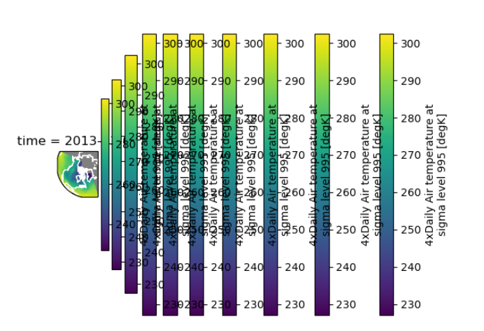

# SSCCE of xarray plot with duplicate colorbars




## Running

Create env:

```bash
conda env create
conda activate sscce-xarray-plot-dup-colorbar
```

Start service:

```bash
PYTHONPATH=. python sscce_xarray_plot_dup_colorbar/__init__.py
```
